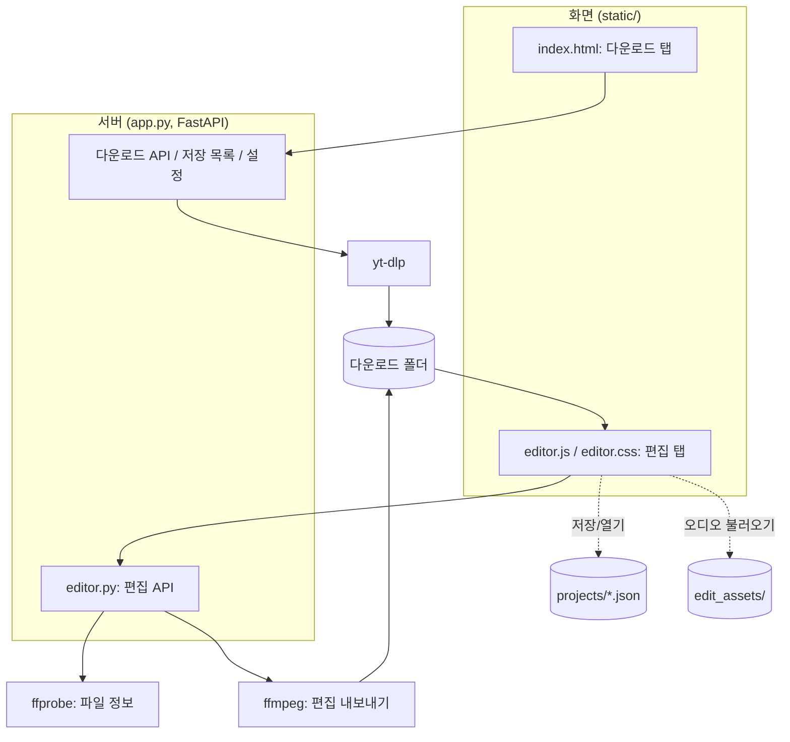
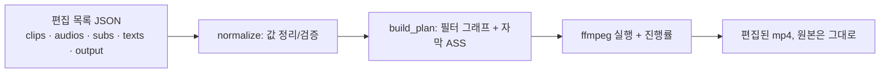

# 구성도

```mermaid
flowchart TB
  subgraph 화면["화면 (static/)"]
    A[index.html: 다운로드 탭] 
    B[editor.js / editor.css: 편집 탭]
  end
  subgraph 서버["서버 (app.py, FastAPI)"]
    C[다운로드 API / 저장 목록 / 설정]
    D[editor.py: 편집 API]
  end
  A --> C --> E[yt-dlp]
  B --> D
  D --> F[ffprobe: 파일 정보]
  D --> G[ffmpeg: 편집 내보내기]
  E --> H[(다운로드 폴더)]
  G --> H
  H --> B
  B -. 저장/열기 .-> I[(projects/*.json)]
  B -. 오디오 불러오기 .-> J[(edit_assets/)]
```

## 편집 데이터 흐름

```mermaid
flowchart LR
  P[편집 목록 JSON<br/>clips · audios · subs · texts · output] --> N[normalize: 값 정리/검증]
  N --> BP[build_plan: 필터 그래프 + 자막 ASS]
  BP --> FF[ffmpeg 실행 + 진행률]
  FF --> OUT[편집된 mp4, 원본은 그대로]
```
